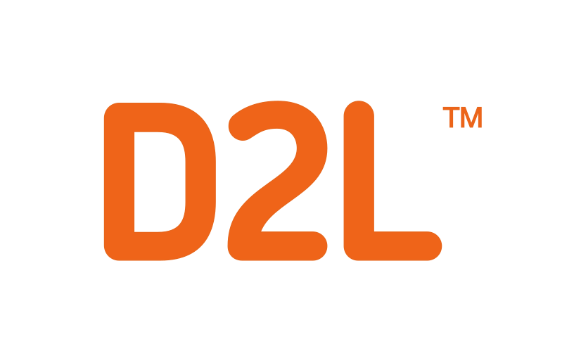
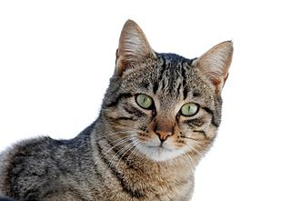

# Hello, world!

This is a static webpage generated from rendered Markdown files and with Valence UI theming.

Here's a link to [another document](/foo.html).

A table:

| Left align | Right align | Center align |
|:-----------|------------:|:------------:|
| This       |        This |     This
| column     |      column |    column
| will       |        will |     will
| be         |          be |      be
| left       |       right |    center
| aligned    |     aligned |   aligned

Did you hear that Markdown has lists?
- lists
- are
- great

number lists too eh:
1. great even
2. when they have
3. numbers

## A secondary heading

With some *italic* and **bold** text.

> A blockquote
> looks like this
> not so great right now

### Credits

Cat image copyright Alvesgaspar / [CC-BY-SA-3.0](http://creativecommons.org/licenses/by-sa/3.0/), found on [Wikipedia](https://commons.wikimedia.org/wiki/File:Cat_March_2010-1.jpg)

